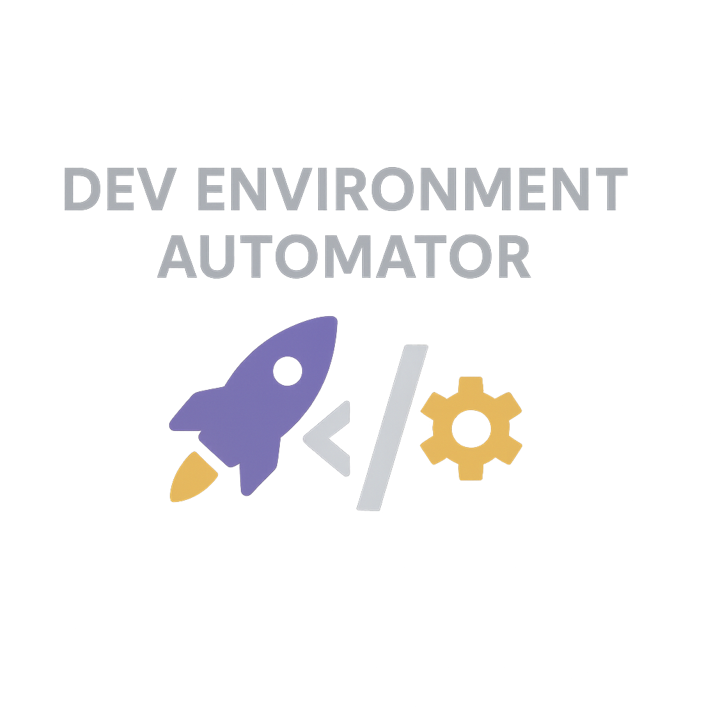

Dev Environment Automator
Automate, launch, code — with style! 🚀

## 🌐 Languages

- [🇺🇸 English](#-dev-environment-automator)
- [🇧🇷 Português](#-automação-do-ambiente-de-desenvolvimento)

# 🚀 Dev Environment Automator

Automate your development workflow with a single command:
✔️ Open project in VSCode
✔️ Switch to a specific workspace
✔️ Start the development server
✔️ Open browser automatically
✔️ Gracefully shutdown on Ctrl+C

## 📦 Features

- ✅ Parameterized project folder, dev command and port.
- ✅ Switch GNOME workspace (using `wmctrl`).
- ✅ Opens VSCode (if installed).
- ✅ Opens browser automatically.
- ✅ Captures `Ctrl+C` → terminates the development server cleanly.
- ✅ Portable across most Linux systems.

## ⚙️ Prerequisites

### ✅ Where does it run?
- **System:** Linux
- **Shell:** Bash

✅ This script is **for Linux environments** that have **Bash** available.
It may work on MacOS with adjustments.
**Does not work on Windows** without a compatibility layer like WSL.

### ✅ Required dependencies:

| Dependency | Purpose |
|------------|--------|
| **wmctrl** | Switches GNOME/Linux workspaces via command-line. |
| **xdg-open** | Opens the default browser to the project URL. |
| **code** (optional) | Opens VSCode directly in the project folder. |

### ✅ Install dependencies:

```bash
sudo apt install wmctrl
```

`xdg-open` is usually pre-installed on Linux desktops.
VSCode must be installed and available as `code` in PATH if desired.

## 🚀 How to use

```bash
./init_dev.sh <project-folder> [<dev-command>] [<port>]
```

### ✅ Example:

```bash
./init_dev.sh my-app "pnpm dev" 3000
```

**Defaults:**
* Dev command: `npm run dev`
* Port: `3000`

## ⌨️ Behavior

* Starts the development server in **background**.
* Waits with a **spinner** for initialization.
* Opens the browser.
* **On Ctrl+C** → gracefully **kills the dev server**.
* No port left hanging.

## ❓ Example log

```text
✔️ Switching to a new workspace...
✔️ Opening VSCode in project: /home/user/Documentos/projetos/my-app
✔️ Starting development server: pnpm dev
⏳ Waiting for the server to start: |
✔️ Server started!
✔️ Opening browser at: http://localhost:3000
^C
❌ Stopping development server...
```

## 📝 License

MIT License.

# 🚀 Automação do Ambiente de Desenvolvimento

Automatize seu fluxo de desenvolvimento com um único comando:
✔️ Abre o projeto no VSCode
✔️ Troca para um workspace específico
✔️ Inicia o servidor de desenvolvimento
✔️ Abre o navegador automaticamente
✔️ Finaliza corretamente ao pressionar Ctrl+C

## 📦 Funcionalidades

* ✅ Parâmetros para pasta do projeto, comando de dev e porta.
* ✅ Troca de workspace no GNOME (usando `wmctrl`).
* ✅ Abre o VSCode automaticamente (se instalado).
* ✅ Abre o navegador automaticamente.
* ✅ Captura `Ctrl+C` → encerra o servidor de desenvolvimento.
* ✅ Portável para a maioria das distribuições Linux.

## ⚙️ Pré-requisitos

### ✅ Onde roda?

* **Sistema:** Linux
* **Shell:** Bash

✅ Este script é para ambientes **Linux** com **Bash** disponível.
Pode funcionar no **MacOS** com ajustes.
**Não funciona no Windows** sem camada de compatibilidade como WSL.

### ✅ Dependências necessárias:

| Dependência         | Função                                                |
| ------------------- | ----------------------------------------------------- |
| **wmctrl**          | Troca workspaces no GNOME/Linux via linha de comando. |
| **xdg-open**        | Abre o navegador padrão na URL do projeto.            |
| **code** (opcional) | Abre o VSCode diretamente na pasta do projeto.        |

### ✅ Instalando as dependências:

```bash
sudo apt install wmctrl
```

O `xdg-open` geralmente já vem instalado nos desktops Linux.
O VSCode precisa estar instalado e disponível como `code` no PATH, se desejar.

## 🚀 Como usar

```bash
./init_dev.sh <pasta-do-projeto> [<comando-dev>] [<porta>]
```

### ✅ Exemplo:

```bash
./init_dev.sh meu-projeto "pnpm dev" 3000
```

**Padrões:**
* Comando dev: `npm run dev`
* Porta: `3000`

## ⌨️ Comportamento

* Inicia o servidor de desenvolvimento em **background**.
* Aguarda com um **spinner** a inicialização.
* Abre o navegador.
* **Ao pressionar Ctrl+C** → finaliza o **servidor corretamente**.
* Nenhuma porta fica presa.

## ❓ Exemplo de log

```text
✔️ Switching to a new workspace...
✔️ Opening VSCode in project: /home/user/Documentos/projetos/meu-projeto
✔️ Starting development server: pnpm dev
⏳ Waiting for the server to start: |
✔️ Server started!
✔️ Opening browser at: http://localhost:3000
^C
❌ Stopping development server...
```

## 📝 Licença

Licença MIT.
